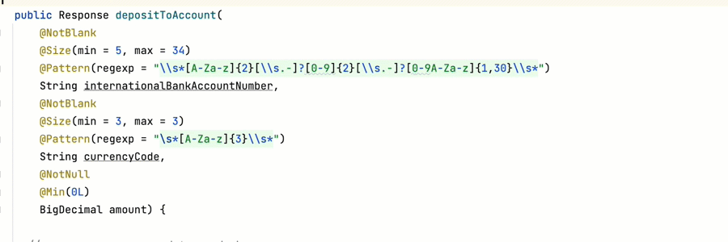

[](https://sonarcloud.io/summary/new_code?id=type-factory_type-factory)
[](https://sonarcloud.io/summary/new_code?id=type-factory_type-factory)
[](https://sonarcloud.io/summary/new_code?id=type-factory_type-factory)
[](https://sonarcloud.io/summary/new_code?id=type-factory_type-factory)
[](https://sonarcloud.io/summary/new_code?id=type-factory_type-factory)
[](https://sonarcloud.io/summary/new_code?id=type-factory_type-factory)
<br/>
[](https://github.com/type-factory/type-factory/actions/workflows/codeql.yml)
[](https://github.com/type-factory/type-factory/actions/workflows/maven-build.yml)
[](https://javadoc.io/doc/org.typefactory/type-factory-core)
[](https://central.sonatype.com/search?q=g%253Aorg.typefactory)

Type Factory
============

Easily create custom data types and remove cruft and boilerplate from your code.

<picture>
  <source srcset="docs/intro-video-dark.gif" media="(prefers-color-scheme: dark)"/>
  
</picture>

Latest release
==============

Type Factory requires that you are using Java 17 or later. 

Consider importing the Type Factory bill-of-materials (bom) into your Maven dependency management section and then add the core and language modules as needed to your Maven dependencies section.

```xml
<!-- Import the bill-of-materials (bom) into your project -->
<dependencyManagement>
  <dependencies>
    <dependency>
      <groupId>org.typefactory</groupId>
      <artifactId>type-factory-bom</artifactId>
      <version>1.0.1</version>
      <type>pom</type>
      <scope>import</scope>
    </dependency>
  </dependencies>
</dependencyManagement>

<!-- Then import the type-factory-core module and 
     optionally the type-factory-language module. --> 
<dependencies>
  <dependency>
    <groupId>org.typefactory</groupId>
    <artifactId>type-factory-core</artifactId>
  </dependency>
  <dependency>
    <groupId>org.typefactory</groupId>
    <artifactId>type-factory-language</artifactId>
  </dependency>
</dependencies>
```

[](https://central.sonatype.com/search?q=g%253Aorg.typefactory)
[](https://central.sonatype.com/search?q=g%253Aorg.typefactory)
[](https://central.sonatype.com/search?q=g%253Aorg.typefactory)

Example 1 – currency code
-------------------------

This example creates a custom type for currency codes that must conform to the ISO 4217 alpha 
  format for a currency code. 

```java
import org.typefactory.StringType;
import org.typefactory.TypeParser;

public final class CurrencyCode extends StringType {                 // ①

  public static final CurrencyCode EMPTY_CURRENCY_CODE = new CurrencyCode("");  // ②

  private static final MessageCode ERROR_MESSAGE = MessageCode.of(   // ③
      "invalid.currency.code", 
      "must be a 3-character ISO 4217 alpha currency code");

  private static final TypeParser TYPE_PARSER = TypeParser.builder() // ④
      .messageCode(ERROR_MESSAGE) // ③
      .acceptCharRange('a', 'z')  // ⑤
      .acceptCharRange('A', 'Z')
      .fixedSize(3)               // ⑥
      .removeAllWhitespace()      // ⑦
      .convertNullToEmpty()       // ⑧
      .toUpperCase()              // ⑨
      .build();

  private CurrencyCode(final String value) {  // ⑩
    super(value);
  }

  public static CurrencyCode of(final CharSequence value) {  // ⑪
    return TYPE_PARSER.parseToStringType(value, CurrencyCode::new); 
  }
}
```
① Our currency code class is declared to be “final” and it will also be immutable.
  By extending `StringType` it will also implement `CharSequence`, `Comparable`
  and `Serializable`, and receive default implementations of all their required
  methods, as well as receive appropriate implementations of the `equals`,
  `hashCode` and `toString` methods.

② We've created an “empty” constant which can be re-used throughout our code
  where needed. Of course, this constant is optional.

③ We provide a message code with a default error message that will be used to 
  create an `InvalidValueException` when the value being parsed doesn't meet 
  the required criteria for a currency-code. Error messages can be localized 
  by provide localized resource bundles. Consider defining all your message codes
  in a separate class.

④ We create a static, immutable, threadsafe, type-parser using a builder.
This type-parser will do the heavy lifting of parsing and/or cleaning a
value so that a valid `CurrencyCode` can be created.

⑤ We specify the characters that are acceptable for a currency-code.

⑥ We specify that the parsed value for a currency-code must be exactly 3
  characters. For other types you can specify min and max sizes.

⑦ We will remove any whitespace that is present in incoming values while parsing
  it. For other types, you could also choose to _normalise_ or _preserve_
  whitespace characters, or _convert_ them to some other character.

⑧ We would like the type-parser to convert null values to empty. If you
  prefer, you could also choose to preserve-null-and-empty or convert
  empty-to-null.

⑨ The parser will convert any lowercase letters to uppercase.

⑩ In this example, we specify a private constructor because we'd like all
  instantiation to occur via the factory method defined in step ⑪. You can,
  of course, choose to use a constructor instead a factory method.

⑪ We will provide a static factory method, `of(value)`, to instantiate 
  a `CurrencyCode` using the value provided.


Example 2 – international bank account number (IBAN)
----------------------------------------------------

This example creates a custom type for international bank account numbers that also employs:

* A regular expression to ensure correct format.
* A custom validator to check IBAN check digits using a modulo-97 algorithm.

Below we've only highlighted the features not already introduced in the previous example.

```java
import java.util.regex.Pattern;
import org.typefactory.StringType;
import org.typefactory.TypeParser;

public final class InternationalBankAccountNumber extends StringType {

  public static final InternationalBankAccountNumber EMPTY_IBAN = 
      new InternationalBankAccountNumber("");

  private static final MessageCode ERROR_MESSAGE = MessageCode.of(
      "invalid.international.bank.account.number", 
      "must be a valid 5..34 character International Bank Account Number (IBAN)");

  private static final Pattern VALID_IBAN_PATTERN = 
      Pattern.compile("[A-Z]{2}+[0-9]{2}+[0-9A-Z]{1,30}+");  // ①

  private static final TypeParser TYPE_PARSER = TypeParser.builder()
          .messageCode(ERROR_MESSAGE)
          .acceptLettersAtoZ()  // ②
          .acceptDigits0to9()   // ③
          .minSize(5)
          .maxSize(34)
          .removeAllWhitespace()
          .removeAllChars('.', '-', '–', '—')  // ④  period, hyphen, en-dash and em-dash
          .toUpperCase()
          .matchesRegex(VALID_IBAN_PATTERN)    // ⑤
          .customValidator(InternationalBankAccountNumber::isValidIBAN)  // ⑥
          .build();

  private InternationalBankAccountNumber(final String value) {
    super(value);
  }

  public static InternationalBankAccountNumber of(final CharSequence value) {
    return TYPE_PARSER.parseToStringType(value, InternationalBankAccountNumber::new);
  }

  private static final long MAX = 999999999;   // ⑦
  private static final long MODULUS = 97;
  private static final int MAX_ALPHANUMERIC_VALUE = 35;

  private static boolean isValidIBAN(final String value) {  // ⑧
    final int valueLength = value.length();
    long total = 0;
    for (int i = 0; i < valueLength; ++i) {
      final int numericValue = Character.getNumericValue(value.charAt((i + 4) % valueLength));
      if (numericValue < 0 || numericValue > MAX_ALPHANUMERIC_VALUE) {
        return false;
      }
      total = (numericValue > 9 ? total * 100 : total * 10) + numericValue;
      if (total > MAX) {
        total = total % MODULUS;
      }
    }
    return (total % MODULUS) == 1;
  }
}
```
① A regular expression to ensure the international bank account number (IBAN) is 
  correctly formatted.

② Convenience method to accept all [a-zA-Z] characters.

③ Convenience method to accept all [0-9] characters.

④ Remove all periods (dots), hyphens, en-dashes and em-dashes from the value.

⑤ Ensure that all values conform to the regular expression we created at step ①.

⑥ Ensure that all values conform to the custom validation method implemented 
  in step ⑧.

⑦ Some constants required by the custom validation method implemented in step ⑧.

⑧ The custom validation method that ensure the IBAN check digits are correct 
  as per the modulo-97 rules for an IBAN.


